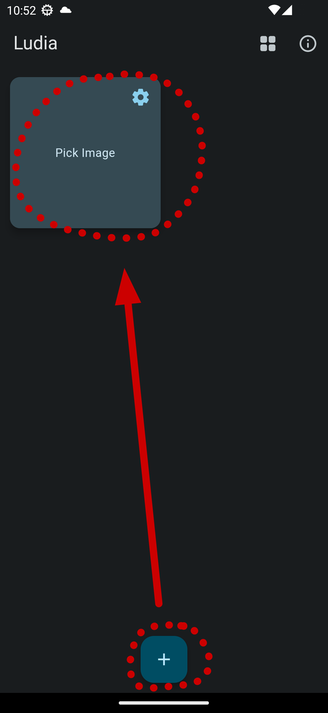
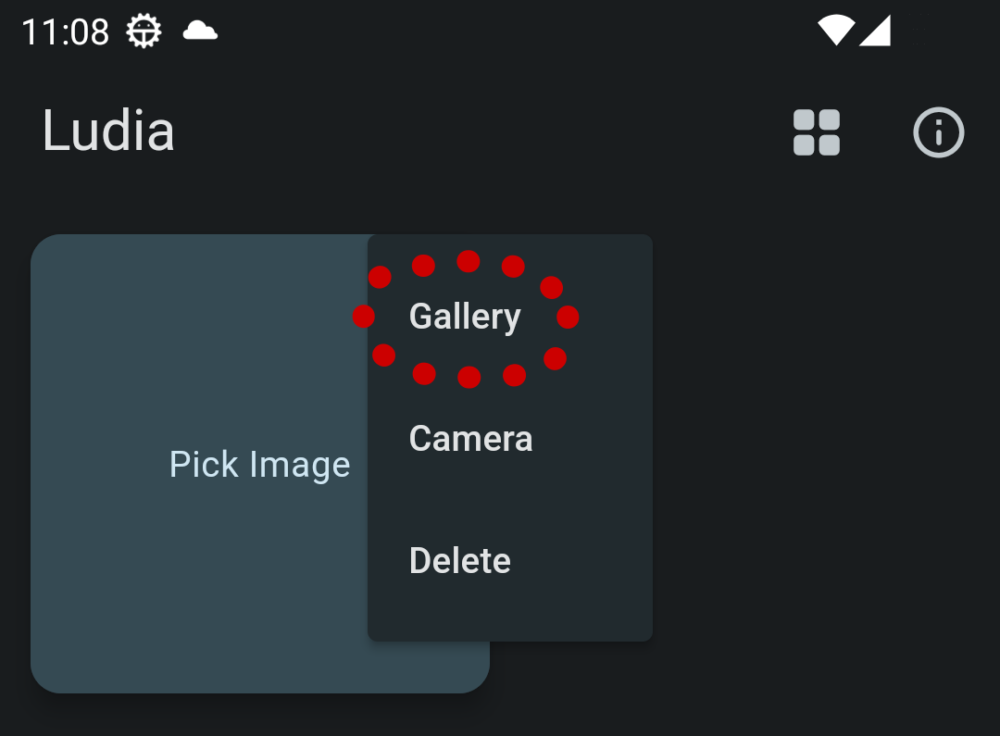
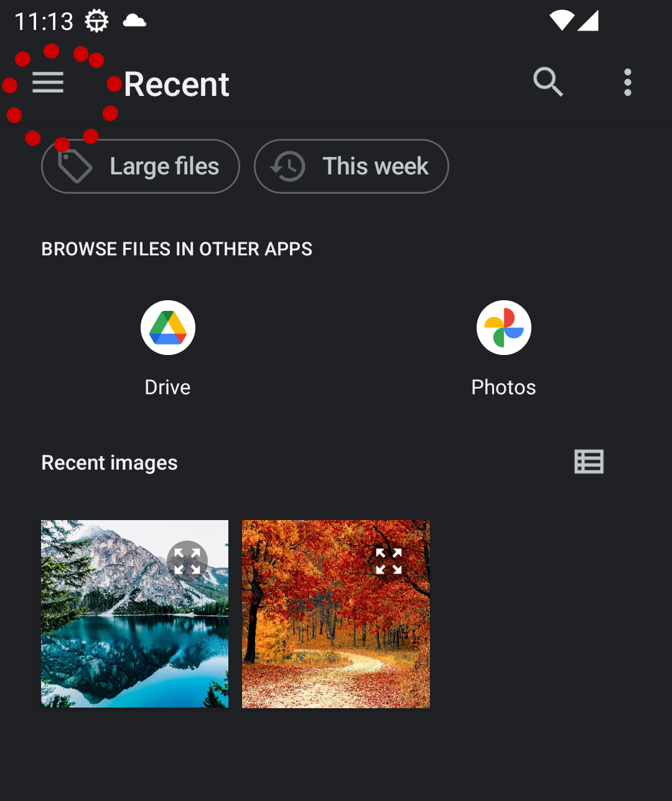
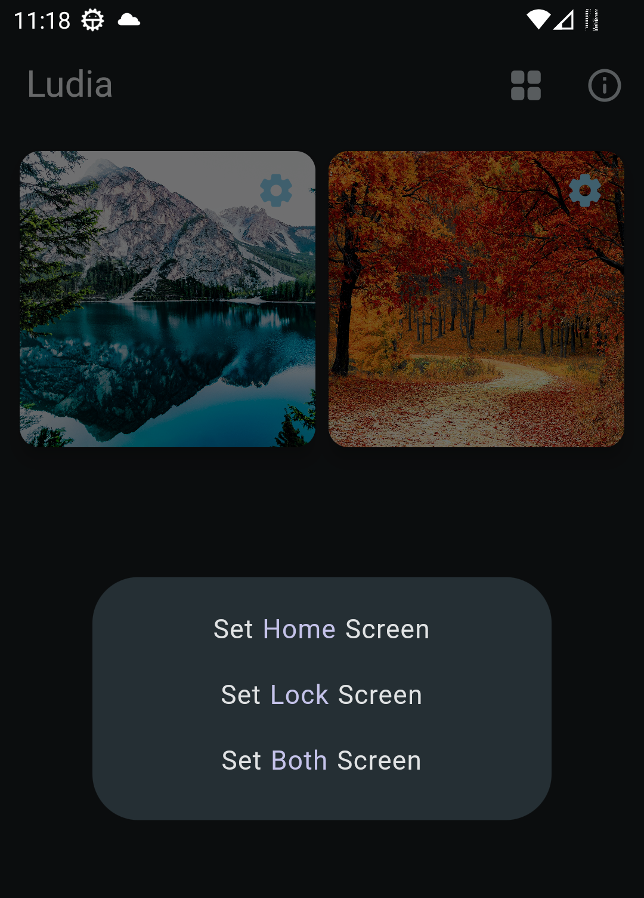
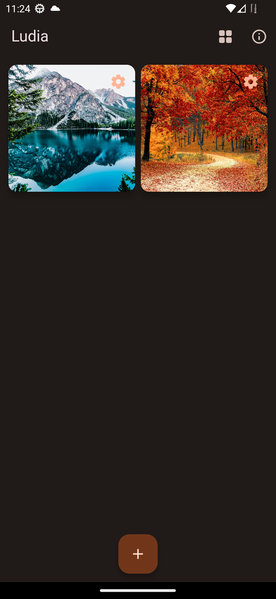

# Instruction

## Create a template

Tap the plus button at the bottom center and create an image template.

## Add image from gallery

Tap the settings button of the template and select *Gallery* menu.

By default, Gallery shows *Recent* images. If you want to go elsewhere,
select the menu at the top left corner, where you can choose other folders,
like **Download** folder.

Select the image you want and come back to the main screen. 

## Change wallpaper

Now you can tap the image to change the wallpapers.

This will take some time depending on the size of the image. 
Once new wallpapers were applied, you can see the app has a new theme
as the app obeys Material 3 Dynamic Color.

## Contact US

Please [email us.](mailto:nuntium.ubique@innomatic.ca)
You can find the email link inside the app too: `About > App Info`